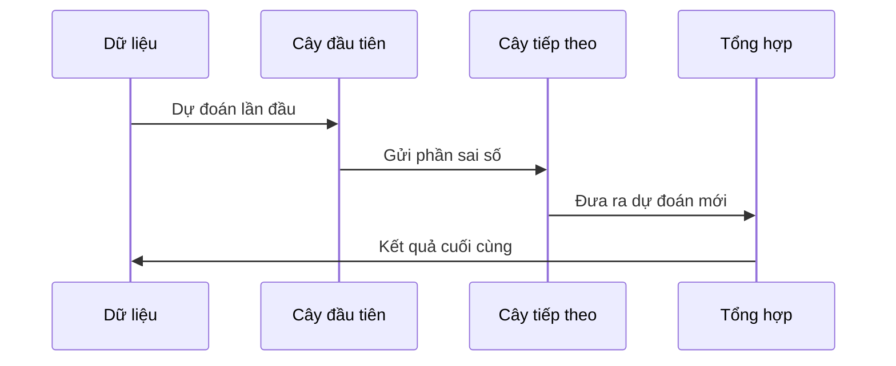
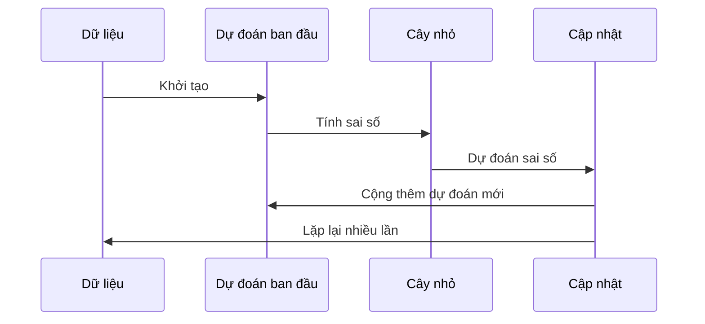

# Chapter 2: Bộ Tăng Cường Gradient (Gradient Boosting)


Chào mừng bạn đến với chương 2! Ở [Chương 1: XGBoost - Tăng Cường Cây Quyết Định Cực Đại](01_xgboost___tăng_cường_cây_quyết_định_cực_đại_.md), chúng ta đã làm quen với XGBoost và cách nó sử dụng nhiều cây quyết định để dự đoán tốt hơn. Nhưng bạn có bao giờ tự hỏi: **Làm thế nào mà các cây này lại kết hợp với nhau một cách thông minh như vậy?** Đó chính là nhờ vào **Bộ Tăng Cường Gradient (Gradient Boosting)** – nền tảng cốt lõi của XGBoost!

---

## Động lực: Khi một cây chưa đủ thông minh

Hãy tưởng tượng bạn đang cố gắng dự đoán xem một khách hàng có mua sản phẩm hay không. Bạn dùng một cây quyết định, nhưng kết quả vẫn còn nhiều sai sót. Nếu chỉ dựa vào một cây, mô hình sẽ dễ bị thiếu sót hoặc dự đoán sai ở những trường hợp khó.

**Vậy làm sao để cải thiện?**  
Giống như khi bạn làm bài tập khó: bạn làm lần đầu, rồi xem lại chỗ sai, sửa lại, rồi lại kiểm tra tiếp... Cứ như vậy, mỗi lần bạn lại tiến gần hơn đến đáp án đúng. Đó chính là ý tưởng của **Bộ Tăng Cường Gradient**!

---

## Bộ Tăng Cường Gradient là gì?

**Bộ Tăng Cường Gradient** là một kỹ thuật kết hợp nhiều mô hình yếu (thường là cây quyết định nhỏ) lại với nhau. Mỗi cây mới sẽ tập trung vào **sửa lỗi** của các cây trước đó. Sau nhiều vòng lặp, các cây này cùng nhau tạo thành một mô hình mạnh mẽ, dự đoán chính xác hơn rất nhiều.

### Ví dụ thực tế

- Dự đoán khách hàng có rời bỏ dịch vụ không?
- Dự đoán giá nhà dựa trên nhiều đặc điểm khác nhau.
- Phân loại email là spam hay không spam.

---

## Các khái niệm chính trong Bộ Tăng Cường Gradient

Để hiểu rõ hơn, hãy cùng nhau bóc tách từng thành phần:

### 1. Mô hình yếu (Weak Learner)

- Thường là một cây quyết định nhỏ, chỉ dự đoán tốt hơn một chút so với đoán ngẫu nhiên.
- Ví dụ: Một cây chỉ dựa vào "tuổi" để dự đoán khách hàng mua hàng.

### 2. Sai số (Residual/Error)

- Là phần mà mô hình hiện tại dự đoán sai so với thực tế.
- Mỗi cây mới sẽ tập trung vào **học từ sai số này**.

### 3. Gradient

- Là hướng điều chỉnh để giảm sai số nhanh nhất.
- Mỗi vòng lặp, mô hình sẽ "đi theo hướng gradient" để dự đoán tốt hơn.

### 4. Tăng cường (Boosting)

- Quá trình lặp lại nhiều lần: mỗi lần thêm một cây mới để sửa lỗi của mô hình hiện tại.
- Kết quả cuối cùng là tổng hợp dự đoán của tất cả các cây.

---

## Quy trình hoạt động của Bộ Tăng Cường Gradient

Hãy cùng xem quy trình này diễn ra như thế nào qua một ví dụ đơn giản:

### Bước 1: Khởi tạo dự đoán ban đầu

Giả sử bạn dự đoán tất cả khách hàng đều **không mua** (hoặc lấy giá trị trung bình nếu là bài toán hồi quy).

### Bước 2: Tính sai số (residual)

So sánh dự đoán với thực tế, tính ra phần sai số.

### Bước 3: Xây dựng cây mới để dự đoán sai số

Huấn luyện một cây quyết định nhỏ để dự đoán chính xác phần sai số này.

### Bước 4: Cập nhật dự đoán

Cộng thêm dự đoán mới từ cây vừa xây dựng vào dự đoán hiện tại.

### Bước 5: Lặp lại

Tiếp tục lặp lại các bước trên nhiều lần. Mỗi cây mới lại học từ lỗi của mô hình hiện tại.

---

## Minh họa bằng sơ đồ

Hãy hình dung quá trình này như một nhóm bạn cùng giải một bài toán:



- **Cây đầu tiên** dự đoán sơ bộ.
- **Cây tiếp theo** tập trung vào phần mà cây đầu tiên dự đoán sai.
- **Tổng hợp** kết quả của các cây lại để ra dự đoán cuối cùng.

---

## Ví dụ sử dụng Bộ Tăng Cường Gradient

Giả sử bạn có dữ liệu khách hàng như sau:

```python
import pandas as pd

X = pd.DataFrame({
    'tuoi': [25, 35, 45, 20, 35],
    'thu_nhap': [50, 80, 60, 40, 90]
})
y = [0, 1, 1, 0, 1]  # 0: Không mua, 1: Mua
```

*Giải thích*: `X` là dữ liệu đặc trưng, `y` là nhãn thực tế.

---

### Huấn luyện mô hình tăng cường gradient

Bạn có thể sử dụng lớp `GradientBoostingClassification` để huấn luyện mô hình:

```python
from Freidman-2001-Gradeint-Boosting-Machines import GradientBoostingClassification

model = GradientBoostingClassification()
model.fit(X, y)
```

*Giải thích*: Đầu tiên, bạn tạo một mô hình tăng cường gradient, sau đó huấn luyện nó với dữ liệu của mình.

---

### Dự đoán kết quả mới

```python
du_doan = model.predict(X)
print(du_doan)
```

*Giải thích*: Mô hình sẽ dự đoán xác suất từng khách hàng sẽ mua sản phẩm.

---

## Bên trong Bộ Tăng Cường Gradient hoạt động như thế nào?

Khi bạn gọi `fit`, quá trình sẽ diễn ra như sau:

1. **Khởi tạo dự đoán ban đầu** (ví dụ: tất cả là 0.5 hoặc giá trị trung bình).
2. **Lặp lại nhiều vòng**:
    - Tính sai số (residual) giữa dự đoán và thực tế.
    - Xây dựng một cây quyết định nhỏ để dự đoán phần sai số này.
    - Cập nhật dự đoán bằng cách cộng thêm dự đoán mới từ cây vừa xây dựng.
3. **Lưu lại các cây đã huấn luyện** để sử dụng khi dự đoán.

---

### Minh họa quy trình bằng sơ đồ



---

## Bóc tách mã nguồn: Bộ Tăng Cường Gradient hoạt động ra sao?

Hãy xem một đoạn mã đơn giản trong file `Freidman-2001-Gradeint-Boosting-Machines.py`:

```python
def fit(self, X, y, boosting_rounds=5):
    self.base_pred = self.log_odds(y)
    for booster in range(boosting_rounds):
        pseudo_residuals = self.negativeDerivitiveLogloss(y, self.base_pred)
        boosting_tree = DecisionTreeRegressor().fit(X, pseudo_residuals)
        self.base_pred += 0.1 * boosting_tree.predict(X)
        self.estimators.append(boosting_tree)
```

*Giải thích từng bước*:

- **Khởi tạo dự đoán ban đầu** bằng log odds của nhãn.
- **Lặp lại nhiều vòng**:
    - Tính sai số (pseudo_residuals).
    - Huấn luyện một cây quyết định nhỏ để dự đoán sai số này.
    - Cập nhật dự đoán tổng thể bằng cách cộng thêm dự đoán mới (có nhân với learning_rate).
    - Lưu lại cây vừa huấn luyện.

---

## Một số tham số quan trọng

- **learning_rate**: Tốc độ học, càng nhỏ thì mô hình học chậm nhưng ổn định hơn.
- **depth**: Độ sâu tối đa của mỗi cây nhỏ.
- **min_leaf**: Số lượng mẫu tối thiểu ở mỗi lá.

Bạn có thể điều chỉnh các tham số này khi gọi `fit`:

```python
model.fit(X, y, learning_rate=0.1, depth=3)
```

---

## Tổng kết

- **Bộ Tăng Cường Gradient** là nền tảng giúp XGBoost và nhiều thuật toán mạnh mẽ khác hoạt động hiệu quả.
- Kỹ thuật này kết hợp nhiều cây quyết định nhỏ, mỗi cây học từ lỗi của cây trước, giúp mô hình ngày càng chính xác hơn.
- Bạn đã biết cách sử dụng và hiểu được quy trình bên trong của Bộ Tăng Cường Gradient.

Ở chương tiếp theo, chúng ta sẽ đi sâu vào **Cây Quyết Định (Node)** – thành phần quan trọng tạo nên sức mạnh của từng bước tăng cường. Hãy tiếp tục khám phá tại: [Cây Quyết Định (Node)](03_cây_quyết_định__node__.md)

