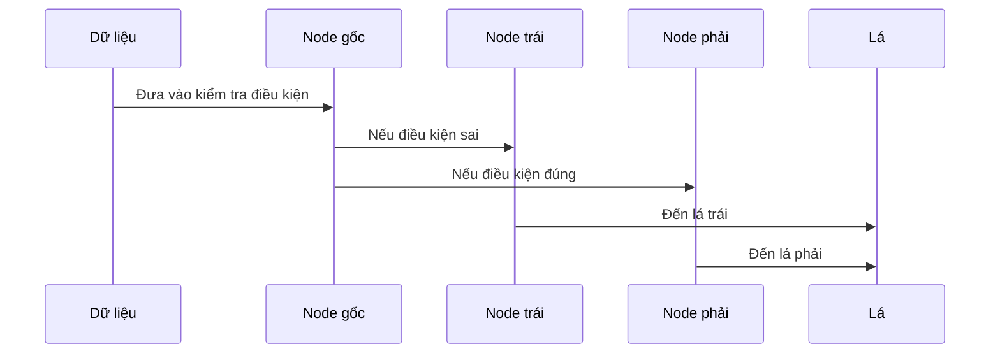

# Chapter 3: Cây Quyết Định (Node)


Chào mừng bạn đến với chương 3! Ở [Chương 2: Bộ Tăng Cường Gradient (Gradient Boosting)](02_bộ_tăng_cường_gradient__gradient_boosting__.md), bạn đã biết cách nhiều cây nhỏ kết hợp lại để tạo thành một mô hình mạnh mẽ. Nhưng mỗi “cây” đó thực chất được xây dựng như thế nào? Bí mật nằm ở **Cây Quyết Định (Node)** – thành phần cốt lõi giúp mô hình học cách phân chia dữ liệu thông minh.

---

## Động lực: Làm sao để máy tính “ra quyết định”?

Hãy tưởng tượng bạn là một nhân viên bán hàng. Khi gặp khách, bạn sẽ hỏi: “Khách này bao nhiêu tuổi?”, “Thu nhập thế nào?”, “Thường mua sản phẩm gì?”... Mỗi câu hỏi giúp bạn phân loại khách hàng thành các nhóm nhỏ hơn, từ đó dự đoán khả năng mua hàng.

**Cây Quyết Định** trong máy học cũng hoạt động tương tự:  
- Mỗi **nút (node)** là một điểm đặt câu hỏi (ví dụ: “tuổi > 30?”).
- Dữ liệu sẽ được chia nhỏ dần qua từng nút, cho đến khi vào các nhóm nhỏ nhất (lá – leaf).

---

## Cây Quyết Định (Node) là gì?

- **Node** là một “điểm quyết định” trong cây, nơi dữ liệu được kiểm tra và chia thành hai nhánh nhỏ hơn dựa trên một điều kiện cụ thể.
- Quá trình này lặp lại nhiều lần, tạo thành một cấu trúc giống như cây phân nhánh.
- Ở mỗi node, thuật toán sẽ chọn ra cách chia dữ liệu tốt nhất để phân biệt các nhóm.

### Ví dụ minh họa

Giả sử bạn có bảng dữ liệu khách hàng như sau:

| Tuổi | Thu nhập | Mua hàng (y) |
|------|----------|--------------|
| 25   | 50       | 0            |
| 35   | 80       | 1            |
| 45   | 60       | 1            |
| 20   | 40       | 0            |
| 35   | 90       | 1            |

Một cây quyết định có thể hỏi:
- “Tuổi > 30?”  
  - Nếu **Không**: sang nhánh trái.
  - Nếu **Có**: sang nhánh phải.

---

## Các khái niệm chính trong Node

### 1. Nút (Node) và Lá (Leaf)

- **Node**: Điểm đặt câu hỏi, chia dữ liệu thành hai nhánh.
- **Leaf**: Nút cuối cùng, không chia tiếp nữa. Tại đây, mô hình sẽ đưa ra dự đoán.

### 2. Điều kiện chia (Split)

- Mỗi node sẽ chọn một đặc trưng (ví dụ: tuổi, thu nhập) và một giá trị để chia dữ liệu.
- Mục tiêu: Chia sao cho hai nhóm sau khi chia càng “khác biệt” càng tốt.

### 3. Độ sâu cây (Depth)

- Số tầng của cây, càng sâu thì cây càng phức tạp.
- Độ sâu lớn giúp mô hình học kỹ hơn, nhưng dễ bị quá khớp.

### 4. Số lượng mẫu tối thiểu ở mỗi lá (min_leaf)

- Đảm bảo mỗi lá có đủ dữ liệu, tránh chia quá nhỏ.

---

## Cách sử dụng Node để giải quyết bài toán

Giả sử bạn muốn xây dựng một cây quyết định để dự đoán khách hàng có mua hàng không.

### Bước 1: Chuẩn bị dữ liệu

```python
import pandas as pd

X = pd.DataFrame({
    'tuoi': [25, 35, 45, 20, 35],
    'thu_nhap': [50, 80, 60, 40, 90]
})
y = [0, 1, 1, 0, 1]
```

*Giải thích*:  
`X` là bảng đặc trưng (tuổi, thu nhập), `y` là nhãn (có mua hay không).

---

### Bước 2: Xây dựng một Node đầu tiên

```python
from XGBoost import Node
import numpy as np

# Khởi tạo node gốc với toàn bộ dữ liệu
node = Node(X.values, np.array([0.1, -0.2, 0.3, -0.1, 0.2]), 
            np.array([1, 1, 1, 1, 1]), 
            np.arange(len(y)), min_leaf=2, depth=2)
```

*Giải thích*:  
- `X.values`: Dữ liệu đặc trưng.
- Tham số thứ 2 và 3 là gradient và hessian (tạm thời dùng số giả để minh họa).
- `min_leaf=2`: Mỗi lá phải có ít nhất 2 mẫu.
- `depth=2`: Cây tối đa 2 tầng.

---

### Bước 3: Dự đoán với cây vừa xây dựng

```python
# Dự đoán giá trị cho từng dòng dữ liệu
ket_qua = node.predict(X.values)
print(ket_qua)
```

*Giải thích*:  
Kết quả là một mảng giá trị dự đoán cho từng khách hàng.

---

## Bên trong Node hoạt động như thế nào?

Hãy hình dung quá trình xây dựng cây như sau:



- Dữ liệu đi vào node gốc, node này đặt một câu hỏi (ví dụ: “tuổi > 30?”).
- Dữ liệu được chia thành hai nhóm: trái và phải.
- Quá trình này lặp lại ở các node con cho đến khi đạt đến lá.

---

## Bóc tách bên trong: Node hoạt động ra sao?

### 1. Tìm điểm chia tốt nhất

Ở mỗi node, thuật toán sẽ thử tất cả các đặc trưng và các giá trị có thể để tìm ra cách chia dữ liệu tốt nhất.

```python
def find_greedy_split(self, var_idx):
    x = self.x[self.idxs, var_idx]
    for r in range(self.row_count):
        lhs = x <= x[r]
        rhs = x > x[r]
        # Kiểm tra điều kiện đủ mẫu
        if(rhs.sum() < self.min_leaf or lhs.sum() < self.min_leaf): continue
        curr_score = self.gain(lhs, rhs)
        if curr_score > self.score:
            self.var_idx = var_idx
            self.score = curr_score
            self.split = x[r]
```

*Giải thích*:  
- Với mỗi đặc trưng, thử từng giá trị để chia dữ liệu.
- Tính “điểm số” cho mỗi cách chia (dựa trên độ khác biệt giữa hai nhóm).
- Lưu lại cách chia tốt nhất.

---

### 2. Tính giá trị tại lá (leaf value)

Khi không thể chia tiếp, node trở thành lá và tính giá trị dự đoán:

```python
def compute_gamma(self, gradient, hessian):
    return(-np.sum(gradient)/(np.sum(hessian) + self.lambda_))
```

*Giải thích*:  
- Công thức này giúp tìm giá trị tối ưu cho lá, dựa trên gradient và hessian (độ dốc và độ chắc chắn của lỗi).

---

### 3. Dự đoán cho một dòng dữ liệu

Khi dự đoán, dữ liệu sẽ đi qua các node theo điều kiện cho đến khi đến lá:

```python
def predict_row(self, xi):
    if self.is_leaf:
        return self.val
    node = self.lhs if xi[self.var_idx] <= self.split else self.rhs
    return node.predict_row(xi)
```

*Giải thích*:  
- Nếu là lá, trả về giá trị dự đoán.
- Nếu không, kiểm tra điều kiện và đi tiếp sang node con trái hoặc phải.

---

## Tổng kết

- **Node** là “bộ não” của cây quyết định, giúp mô hình tự động đặt câu hỏi và chia nhỏ dữ liệu.
- Quá trình xây dựng cây là liên tục đặt các câu hỏi để phân loại dữ liệu tốt nhất.
- Hiểu Node là nền tảng để hiểu cách các mô hình boosting như XGBoost hoạt động.

Ở chương tiếp theo, chúng ta sẽ tiếp tục khám phá các khái niệm nâng cao hơn về cách xây dựng và tối ưu hóa mô hình. Hãy tiếp tục với: [XGBoost - Tăng Cường Cây Quyết Định Cực Đại](01_xgboost___tăng_cường_cây_quyết_định_cực_đại_.md) nếu bạn muốn ôn lại tổng quan, hoặc quay lại [Bộ Tăng Cường Gradient (Gradient Boosting)](02_bộ_tăng_cường_gradient__gradient_boosting__.md) để xem lại nền tảng. 

Chúc bạn học vui và tiếp tục khám phá sức mạnh của cây quyết định trong học máy!

