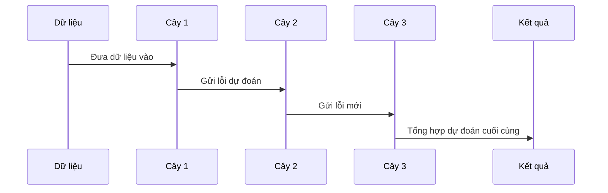

# Chapter 1: XGBoost - Tăng Cường Cây Quyết Định Cực Đại


## Động lực: Giải quyết bài toán dự đoán với dữ liệu phức tạp

Hãy tưởng tượng bạn là một nhà khoa học dữ liệu và bạn muốn dự đoán xem một khách hàng có mua sản phẩm hay không dựa trên các thông tin như tuổi, thu nhập, sở thích... Bạn thử nhiều mô hình đơn giản nhưng kết quả vẫn chưa tốt. Vậy làm sao để mô hình của bạn trở nên mạnh mẽ hơn, dự đoán chính xác hơn?

Đây chính là lúc **XGBoost** xuất hiện như một "siêu anh hùng" trong lĩnh vực học máy!

---

## XGBoost là gì?

**XGBoost** là viết tắt của "Extreme Gradient Boosting" – một thuật toán tăng cường cây quyết định cực kỳ mạnh mẽ, nổi tiếng vì tốc độ nhanh và độ chính xác cao. Bạn có thể hình dung XGBoost giống như một đội ngũ chuyên gia, mỗi người học từ những sai lầm của người trước và cùng nhau đưa ra quyết định tốt nhất.

### Ví dụ thực tế

- Dự đoán khách hàng có rời bỏ dịch vụ không?
- Phân loại email là spam hay không spam?
- Dự đoán giá nhà dựa trên các đặc điểm...

---

## Các khái niệm chính trong XGBoost

Để hiểu XGBoost, hãy cùng nhau khám phá các thành phần quan trọng:

### 1. Cây quyết định (Decision Tree)

- Là một mô hình dự đoán dựa trên các câu hỏi "Có/Không" liên tiếp.
- Mỗi cây giống như một chuyên gia nhỏ, đưa ra dự đoán dựa trên một số đặc điểm nhất định.

### 2. Tăng cường (Boosting)

- Không chỉ dùng một cây, mà dùng nhiều cây liên tiếp.
- Mỗi cây mới sẽ tập trung sửa lỗi của các cây trước đó.
- Kết quả cuối cùng là sự kết hợp thông minh của tất cả các cây.

### 3. Gradient và Hessian

- **Gradient**: Đo lường mức độ sai lệch của dự đoán so với thực tế (giống như "học từ lỗi").
- **Hessian**: Đo lường độ chắc chắn của quyết định (giúp điều chỉnh mô hình tốt hơn).

### 4. Các kỹ thuật hiện đại

- **Chọn cột ngẫu nhiên**: Mỗi cây chỉ xem xét một phần đặc điểm, giúp mô hình đa dạng và tránh quá khớp.
- **Kiểm soát độ sâu cây**: Giới hạn số tầng của cây để tránh học quá kỹ vào dữ liệu huấn luyện.
- **Điều chỉnh phức tạp**: Sử dụng các tham số như lambda, gamma để kiểm soát mô hình.

---

## Sử dụng XGBoost để giải quyết bài toán

Giả sử bạn có một bảng dữ liệu khách hàng và muốn dự đoán họ có mua sản phẩm không.

### Bước 1: Chuẩn bị dữ liệu

```python
import pandas as pd

# Tạo dữ liệu ví dụ
X = pd.DataFrame({
    'tuoi': [25, 35, 45, 20, 35],
    'thu_nhap': [50, 80, 60, 40, 90]
})
y = [0, 1, 1, 0, 1]  # 0: Không mua, 1: Mua
```

*Giải thích*: Ở đây, `X` là dữ liệu đặc trưng (tuổi, thu nhập), còn `y` là nhãn (có mua hay không).

---

### Bước 2: Huấn luyện mô hình XGBoost

```python
from XGBoost import XGBoostClassifier

model = XGBoostClassifier()
model.fit(X, y)
```

*Giải thích*: Đầu tiên, bạn tạo một mô hình XGBoostClassifier, sau đó huấn luyện nó với dữ liệu của mình.

---

### Bước 3: Dự đoán kết quả mới

```python
du_doan = model.predict(X)
print(du_doan)
```

*Giải thích*: Mô hình sẽ dự đoán cho từng khách hàng xem họ có khả năng mua sản phẩm không (kết quả là 0 hoặc 1).

---

## Bên trong XGBoost hoạt động như thế nào?

Hãy hình dung quá trình này như một dây chuyền sản xuất thông minh:



- **Dữ liệu** được đưa vào cây đầu tiên.
- **Cây 1** dự đoán và tính toán lỗi.
- **Cây 2** học từ lỗi của cây 1 và tiếp tục dự đoán.
- **Cây 3** lại học từ lỗi của cây 2.
- Cuối cùng, các cây cùng nhau đưa ra dự đoán tổng hợp.

---

## Bên trong mã nguồn: XGBoost hoạt động ra sao?

Khi bạn gọi `model.fit(X, y)`, quá trình diễn ra như sau:

1. **Khởi tạo dự đoán ban đầu** (ví dụ: dự đoán tất cả là 0.5).
2. **Lặp lại nhiều vòng tăng cường**:
    - Tính toán gradient và hessian cho từng mẫu.
    - Xây dựng một cây quyết định mới dựa trên các giá trị này.
    - Cập nhật dự đoán bằng cách cộng thêm dự đoán mới từ cây vừa xây dựng.
3. **Lưu lại các cây đã huấn luyện** để sử dụng khi dự đoán.

### Ví dụ mã nguồn đơn giản (trích từ file `XGBoost.py`):

```python
def fit(self, X, y, boosting_rounds=5):
    self.base_pred = np.full((X.shape[0], 1), 1).flatten().astype('float64')
    for booster in range(boosting_rounds):
        Grad = self.grad(self.base_pred, y)
        Hess = self.hess(self.base_pred, y)
        boosting_tree = XGBoostTree().fit(X, Grad, Hess)
        self.base_pred += 0.4 * boosting_tree.predict(X)
        self.estimators.append(boosting_tree)
```

*Giải thích*: Mỗi vòng lặp, mô hình xây dựng một cây mới để sửa lỗi của các cây trước đó, và cập nhật dự đoán tổng thể.

---

## Một số tham số quan trọng trong XGBoost

- **learning_rate**: Tốc độ học, càng nhỏ thì mô hình càng học chậm nhưng ổn định.
- **depth**: Độ sâu tối đa của mỗi cây.
- **min_leaf**: Số lượng mẫu tối thiểu ở mỗi lá.
- **lambda_, gamma**: Điều chỉnh độ phức tạp, giúp tránh quá khớp.

Bạn có thể điều chỉnh các tham số này khi gọi `fit`:

```python
model.fit(X, y, learning_rate=0.3, depth=3)
```

---

## Tổng kết

- **XGBoost** là một công cụ mạnh mẽ giúp bạn giải quyết các bài toán dự đoán phức tạp với độ chính xác cao.
- Nó kết hợp nhiều cây quyết định, mỗi cây học từ lỗi của cây trước, sử dụng các kỹ thuật hiện đại để tối ưu hóa.
- Bạn đã biết cách sử dụng XGBoost cho bài toán phân loại đơn giản và hiểu được cách nó hoạt động bên trong.

Ở chương tiếp theo, chúng ta sẽ tìm hiểu sâu hơn về khái niệm **Bộ Tăng Cường Gradient (Gradient Boosting)** – nền tảng quan trọng của XGBoost. Hãy tiếp tục khám phá tại: [Bộ Tăng Cường Gradient (Gradient Boosting)](02_bộ_tăng_cường_gradient__gradient_boosting__.md)

