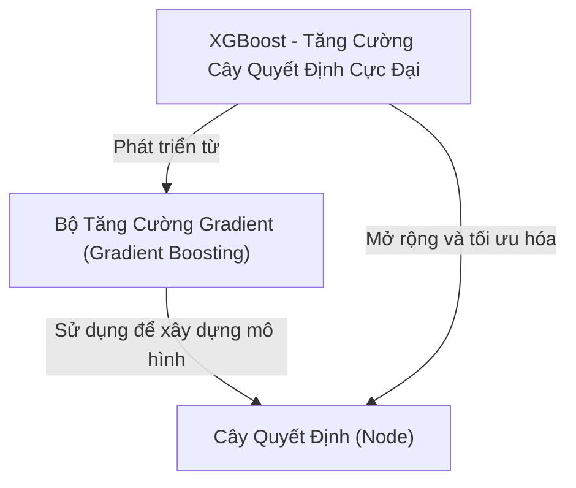

# Tutorial: XGBoost-From-Scratch-Cloned

**XGBoost-From-Scratch-Cloned** là một dự án giúp bạn hiểu và tự xây dựng các thuật toán *tăng cường cây quyết định* (Gradient Boosting và XGBoost) từ đầu bằng Python.  
Dự án này mô phỏng cách các mô hình học máy mạnh mẽ như **XGBoost** hoạt động, bằng cách kết hợp nhiều *cây quyết định* (**Cây Quyết Định**) nhỏ lại để dự đoán chính xác hơn.  
Bạn sẽ thấy rõ từng bước xây dựng cây, cách tính toán gradient, hessian, và cách các mô hình này liên tục cải thiện dự đoán qua từng vòng lặp.  
Đây là tài liệu tuyệt vời cho người mới bắt đầu muốn hiểu sâu về *machine learning* và các thuật toán boosting hiện đại đó.

## Chapters

1. [XGBoost - Tăng Cường Cây Quyết Định Cực Đại
](01_xgboost___tăng_cường_cây_quyết_định_cực_đại_.md)
2. [Bộ Tăng Cường Gradient (Gradient Boosting)
](02_bộ_tăng_cường_gradient__gradient_boosting__.md)
3. [Cây Quyết Định (Node)
](03_cây_quyết_định__node__.md)
